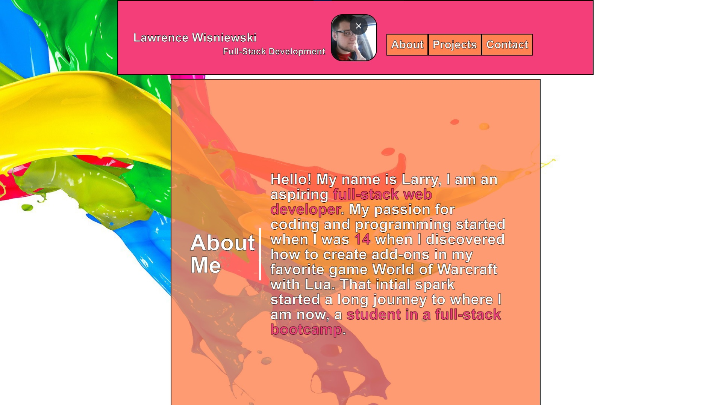

# Larwis Portfolio

## Description
A simple portfolio made to show off Lawrence Wisniewski's HTML and CSS work.

## Installation
N/A

## Usage
Navigate in your browser to: https://larwis95.github.io/larwis-portfolio/. Then use the navigation buttons to scroll to the relevant sections. Under the 'Projects' section hover over and click a project image to be directed to that project's URL.

## Screenshot

## License

N/A